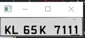
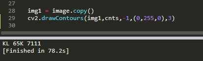

# Plate_detection (Optical character recognition : OCR )

## FILTER APPLICATION

## PLAT EXTRACTION

## CHARACTER EXTRACTION

## Installation Dependencies:
* Python 2.7 or 3
* imutils
* pytesseract

# Instructions
Simply run *extract.py* and watch !

ridabenbouziane@2019
